# ⚒️ Forge: Autonomous AI Agent Swarm


> **"Survival of the best... code."**

**Swarm Forge** is a competitive, multi-agent AI framework that creates a swarm of autonomous developer agents in order to solve a complex user requirement such as an end-to-end tested application. Each agent races in parallel to solve complex coding tasks, writing their own tests, executing them in isolated **Docker Sandboxes**, and iteratively fixing their own bugs until a solution is found.

## 🧠 Core Concept

Most AI coding tools run a single linear path. Forge runs a **genetic-style swarm**:

1.  **Spawn:** Multiple Agents ($A_1 ... A_n$) are instantiated with unique identities.
2.  **Isolate:** Each agent gets a dedicated Docker container (Sandbox).
3.  **Iterate:** Agents write code $\rightarrow$ write tests $\rightarrow$ execute in Docker $\rightarrow$ read errors $\rightarrow$ refactor.
4.  **Race:** The first agent to pass 100% of its test suite wins. The swarm terminates, and the winning code is saved.

## 🏗️ Architecture

```mermaid
graph TD
    User[User Input] -->|Task| Swarm{Swarm Manager}
    Swarm -->|Spawn| Agent1[Agent 1]
    Swarm -->|Spawn| Agent2[Agent 2]
    Swarm -->|Spawn| Agent3[Agent 3]
    
    subgraph "The Loop (Per Agent)"
        Agent1 -->|Generate| Code[Write Code]
        Code -->|Generate| Test[Write Tests]
        Test -->|Execute| Docker[(Docker Sandbox)]
        Docker -->|Result| Decision{Passed?}
        Decision -- No --> Code
        Decision -- Yes --> Winner[🏆 Winner Found]
    end
```



## ✨ Features

🛡️ Secure Sandboxing: All code execution happens inside ephemeral Docker containers. No rm -rf / accidents on your host machine.

📦 Dependency Aware: Agents can request pip packages (e.g., sqlalchemy, pandas) which are dynamically installed in their isolated environment.

🔄 Self-Healing: Agents read their own stack traces and iteratively patch their code without human intervention.

⚡ Parallel Processing: Uses asyncio to run all agents concurrently.

🧩 State Management: Powered by LangGraph for robust state transitions and failure recovery.


## Installation

```bash
git clone https://github.com/tonyc973/forge-swarm.git
cd forge-swarm
python3 -m venv venv
source venv/bin/activate
pip install -r requierements.txt
# setup .env file in which you add the keys (qwen coder was used for generating code)
python main.py
```

## Final note

The project is under work and for many complex, unclear queries it may go into hallucination loops that require some architectural shifts. A better project architect should be added in place and all developer agents must strictly adhere to architect plan.
